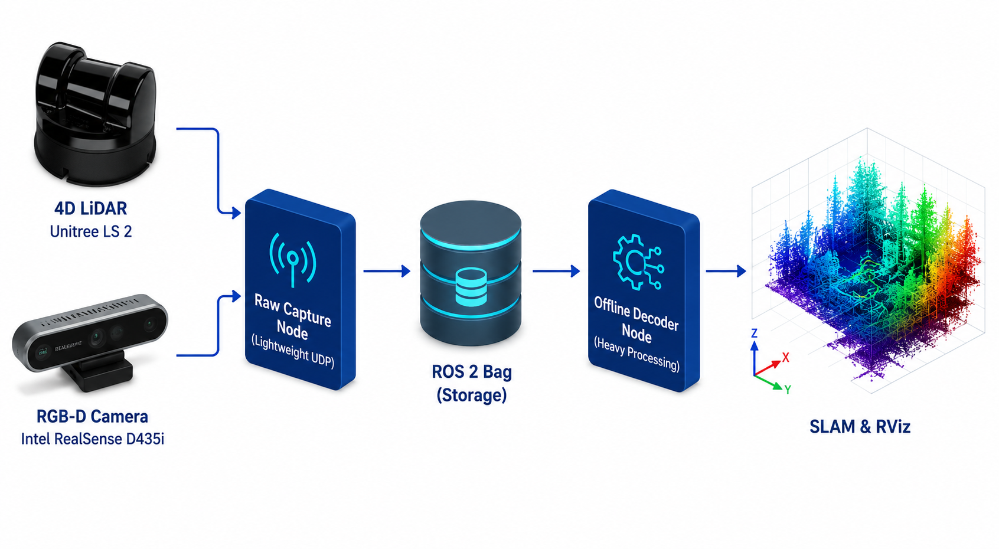

# Lightweight Unitree L2 & RealSense ROS 2 Recorder 


A zero-overhead, multi-stage Dockerized ROS 2 (Jazzy) workspace designed for high-performance raw data acquisition from **Unitree L2 LiDARs** and **Intel RealSense** cameras.

Built specifically for resource-constrained environments — such as UAV onboard computers or custom Terrestrial Laser Scanner (TLS) rigs — this architecture ensures ultra-low latency recording.
<div align="center">
  
</div>

---

## 🧠 Architecture Highlights

Recording dense `PointCloud2` messages directly to a `.bag` file can cause severe CPU bottlenecks and network latency on embedded systems. This package solves this by splitting the workflow into two distinct phases:

1. **Raw Capture Node (`unitree_lidar_ros2_node`):** A highly optimized C++ node that intercepts pure UDP packets (port 6201) and publishes them instantly as custom `LidarMetadata` messages. This keeps CPU usage near 0% during in-field recording.

2. **Offline Decoder Node (`decoder_node`):** A secondary node used post-capture. It translates the raw `.bag` packets into standard `sensor_msgs/PointCloud2` messages **and simultaneously decodes the raw IMU data** (accelerometer + gyroscope readings) embedded in the UDP stream, publishing them as `sensor_msgs/Imu` messages. Both streams are aligned using the statically linked Unitree SDK, preserving perfect timestamp synchronization for tightly-coupled SLAM ingestion (e.g., LIO-SAM, FAST-LIVO).

3. **Multi-stage Docker Build:** The final distributed image contains only the compiled binaries and RealSense drivers. It leaves all C++ source code and build caches behind, resulting in a minimal footprint.

<div align="center">
  
</div>

---

## ⚡ Quick Start (No compilation required)

You do not need to pollute your host machine with ROS 2, C++ compilers, or SDKs. Just pull the pre-built image:

```bash
docker pull lucasfroes232/unitree_realsense_jazzy:v1
```

Run the container with hardware acceleration and host network privileges:

```bash
docker run -it --net=host \
  -e DISPLAY=$DISPLAY \
  -v /tmp/.X11-unix:/tmp/.X11-unix \
  lucasfroes232/unitree_realsense_jazzy:v1
```

---

## 🛠️ Usage Guide

### 1. Wake up the LiDAR motor

Before capturing data, ensure the LiDAR is spinning by sending the initialization command to port 6101. (You can run the standard Unitree UDP example for this.)

### 2. Start the Raw Capture Node

Launch the lightweight node to start listening to the LiDAR's UDP broadcast on port 6201:

```bash
ros2 run unitree_lidar_ros2 unitree_lidar_ros2_node --ros-args -p udp_port:=6201
```

### 3. Launch the RealSense Camera

> ⚠️ **Pro-Tip for Embedded Systems:** To prevent USB bus saturation and keep the `.bag` file size manageable during flights or TLS scanning, it is highly recommended to run the RealSense camera at a lower resolution (e.g., 640x480) and capped at 15 FPS.

```bash
ros2 launch realsense2_camera rs_launch.py \
  align_depth.enable:=true \
  depth_module.depth_profile:=640x480x15 \
  rgb_camera.color_profile:=640x480x15
```

### 4. Record the Dataset (In-Flight / Field)

Start recording the visual data and the lightweight raw LiDAR packets — the `/unilidar/raw` topic contains **both LiDAR and IMU data** multiplexed in the original UDP stream:

```bash
ros2 bag record \
  /camera/camera/color/image_raw \
  /camera/camera/aligned_depth_to_color/image_raw \
  /camera/camera/color/camera_info \
  /camera/camera/aligned_depth_to_color/camera_info \
  /tf \
  /tf_static \
  /unilidar/raw
```

### 5. Post-Processing (Decoding)

Once you are back at your workstation, play the `.bag` file and run the decoder node. It will:

- Decode the raw UDP packets into standard `sensor_msgs/PointCloud2` messages
- **Extract and publish the embedded IMU data** (linear acceleration + angular velocity) as `sensor_msgs/Imu` messages on `/unilidar/imu`
- Preserve timestamp synchronization across both streams for immediate use in RViz or any SLAM pipeline

```bash
# Terminal 1 — replay the recording
ros2 bag play <your_bag_file>

# Terminal 2 — decode PointCloud2 + IMU
ros2 run unitree_lidar_ros2 decoder_node
```

**Decoded output topics:**

| Topic | Type | Description |
|---|---|---|
| `/unilidar/cloud` | `sensor_msgs/PointCloud2` | Decoded 3D point cloud |
| `/unilidar/imu` | `sensor_msgs/Imu` | Decoded IMU (accel + gyro) |

---

## 📂 Repository Structure
```plaintext
.
├── Dockerfile                  # Multi-stage build definition
├── .dockerignore               # Cache and bag exclusion rules
├── README.md    
├── docs                
└── src/
    ├── unitree_lidar_ros2/     # The core ROS 2 package (Capture & Decode)
    └── unitree_lidar_sdk/      # Statically linked Unitree C++ dependencies
```
---

## 🤝 Contributing

Contributions are welcome! If you are working on robotic navigation, SLAM optimization, or UAV/TLS data acquisition, feel free to open an issue or submit a Pull Request.

## 📄 License

This project is open-source and available under the standard MIT License.