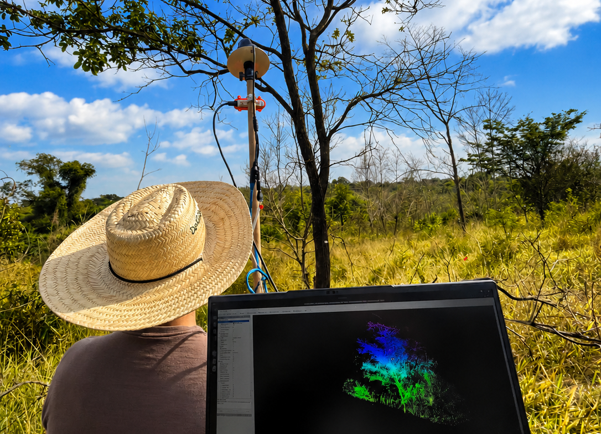
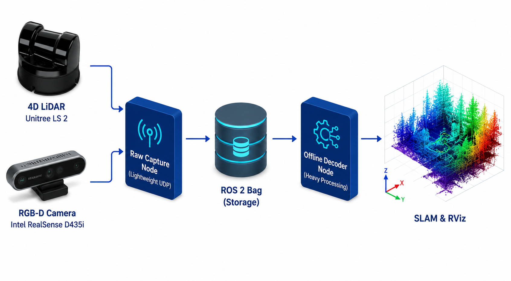
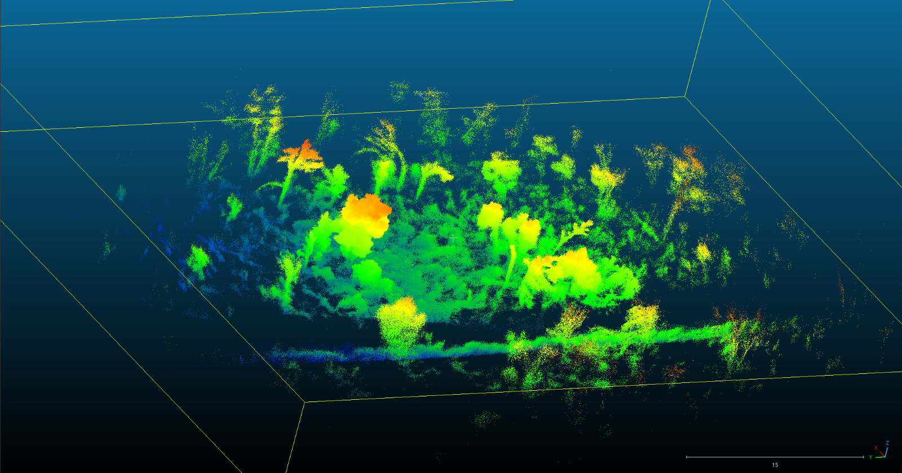

---

# Lightweight Unitree L2 & RealSense ROS 2 Recorder


<p align="center">
  
  
</p>

A zero-overhead, multi-stage Dockerized ROS 2 (Jazzy) workspace designed for high-performance raw data acquisition from **Unitree L2 LiDARs** and **Intel RealSense** cameras. 

Built specifically for resource-constrained environments—such as UAV onboard computers or Terrestrial Laser Scanners (TLS)—this architecture ensures ultra-low latency recording and minimizes disk space usage through advanced compression pipelines, ideal for mapping unstructured outdoor environments.

---

## 🧠 Architecture Highlights

Recording dense `PointCloud2` and raw uncompressed images directly to a `.bag` file causes severe CPU bottlenecks and massive storage consumption on embedded systems. This project solves this via a two-phase workflow:

*   **Phase 1: Raw Capture & Compressed Recording:** A highly optimized C++ node intercepts pure UDP packets from the LiDAR. Simultaneously, the RealSense camera uses `image_transport` plugins to publish JPEG/PNG compressed streams. By capturing only `/compressed` topics and raw UDP payloads, CPU usage remains low and `.bag` files are reduced by up to 90%.
*   **Phase 2: Offline Unified Decoder:** A unified post-capture launch file (`decode_all.launch.py`) translates raw LiDAR packets into `sensor_msgs/PointCloud2`, decodes IMU data, and decompresses visual streams. Everything is perfectly synchronized for SLAM algorithms (e.g., FAST-LIVO).
*   **Multi-stage Docker Build:** The final distributed image contains only compiled binaries and drivers, leaving build caches behind for a minimal footprint.

---
## 📍 Reconstruction Results

By processing the lightweight `.bag` files through our offline decoder, the data is perfectly synchronized and ready for complex SLAM pipelines. Below is an example of a dense 3D point cloud reconstructed from an outdoor deployment:

<p align="center">
  
</p>

---
## ⚡ Quick Start (No compilation required)

You do not need to pollute your host machine with ROS 2, C++ compilers, or SDKs. Just pull the latest pre-built image:

```bash
docker pull lucasfroes232/unitree_realsense_jazzy:latest

```

Run the container with hardware acceleration and host network privileges:

```bash
docker run -it --net=host --privileged \
  -v /dev:/dev \
  -e DISPLAY=$DISPLAY \
  -v /tmp/.X11-unix:/tmp/.X11-unix \
  lucasfroes232/unitree_realsense_jazzy:latest

```

---

## 🛠️ Usage Guide

### 1. Wake up the LiDAR motor

Before capturing, initialize the LiDAR motor (port 6101) and launch the capture node to listen on port 6201:
```bash
./unitree_examples/example_lidar_udp

```

### 2. Start the Raw Capture Node

Launch the lightweight node to start listening to the LiDAR's UDP broadcast on port 6201:

```bash
ros2 run unitree_lidar_ros2 unitree_lidar_ros2_node --ros-args -p udp_port:=6201

```

### 3. Launch the RealSense Camera

> ⚠️ **Pro-Tip for Embedded Systems:** Run the camera at a lower resolution (e.g., 640x480 @ 15 FPS) to prevent USB bus saturation and manage .bag sizes.

```bash
ros2 launch realsense2_camera rs_launch.py \
  align_depth.enable:=true \
  enable_sync:=true \
  depth_module.depth_profile:=640x480x15 \
  rgb_camera.color_profile:=640x480x15

```

### 4. Record the Dataset (In-Flight / Field)

Record the compressed visual data and multiplexed raw LiDAR/IMU packets.

```bash
ros2 bag record -o <your_bag> \
  /camera/camera/color/image_raw/compressed \
  /camera/camera/aligned_depth_to_color/image_raw/compressedDepth \
  /camera/camera/color/camera_info \
  /camera/camera/aligned_depth_to_color/camera_info \
  /tf \
  /tf_static \
  /unilidar/raw

```

### 5. Post-Processing (Decoding)

Back at your workstation, launch the unified decoder and play the .bag file to inflate images and unpack LiDAR/IMU packets.

```bash
# Terminal 1 — Start Decoder
ros2 launch unitree_lidar_ros2 decode_all.launch.py

# Terminal 2 — Replay recording
ros2 bag play <your_bag>

# Terminal 3 — Visualize
rviz2

```
---

## 📂 Repository Structure

```plaintext
.
├── Dockerfile                  # Multi-stage build definition
├── .dockerignore               # Cache and bag exclusion rules
├── README.md    
├── docs                
└── src/
    └── unitree_lidar_ros2/     # The core ROS 2 package
        ├── launch/
        │   └── decode_all.launch.py # Unified decompression and LiDAR decoding
        ├── src/
        │   ├── unitree_lidar_ros2_node.cpp
        │   └── decoder_node.cpp
        ├── CMakeLists.txt
        └── package.xml
    └── unitree_lidar_sdk/      # Statically linked Unitree C++ dependencies

```

---

## 🤝 Contributing

Contributions are welcome! If you are working on robotic navigation, SLAM optimization, or UAV/TLS data acquisition, feel free to open an issue or submit a Pull Request.

## 📄 License

This project is open-source and available under the standard MIT License.